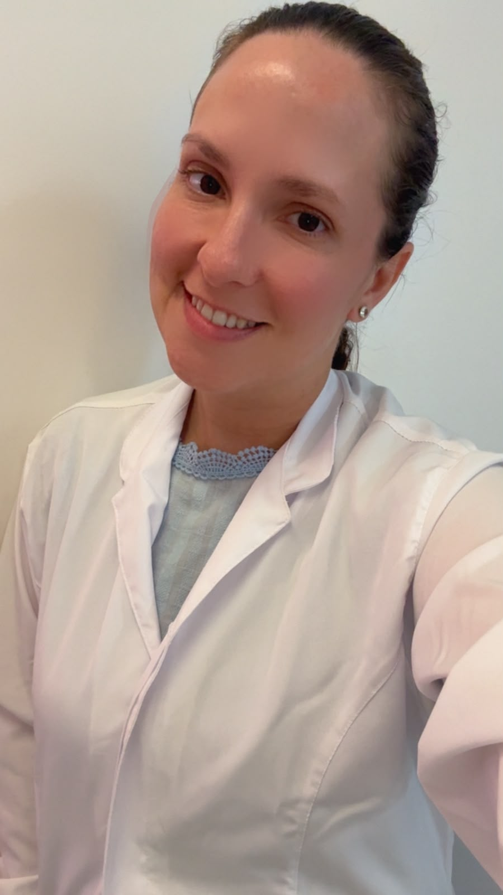
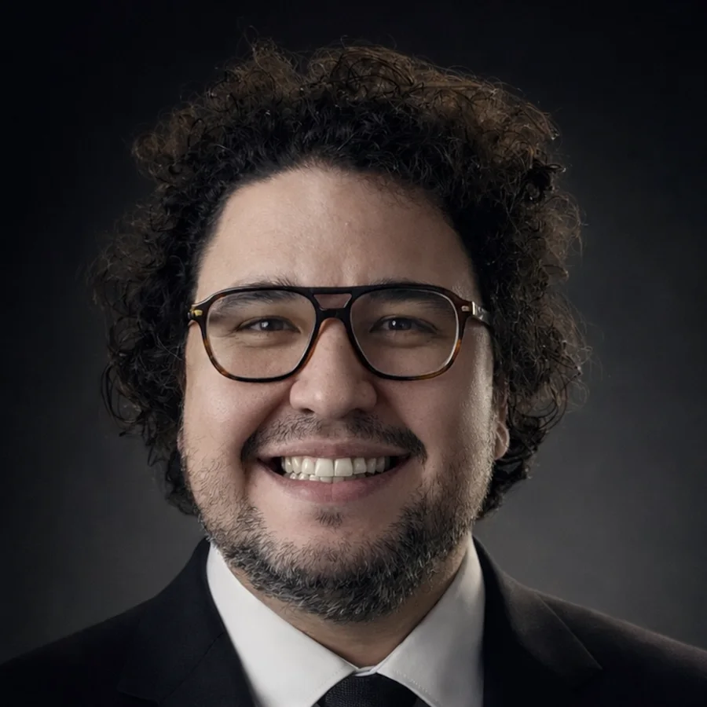

::: {.course-intro}
::: {.course-kicker}
Programa de Pós-Graduação em Microbiologia Médica · Universidade Federal do Ceará
:::

Uma introdução prática aos conceitos, ferramentas e fluxos computacionais utilizados na análise de dados biológicos.

::: {.course-meta}
8 a 29 de setembro de 2026
Presencial · 32 horas
14h às 16h · Sala de aula PPGMM - Biomedicina/UFC
:::

::: {.course-actions}
[Ver cronograma](#cronograma){.btn .btn-primary}
[Acessar materiais](materiais/index.qmd){.btn .btn-outline-primary}
:::
:::

## Objetivos {#objetivos}

Proporcionar uma compreensão introdutória dos conceitos e das ferramentas de bioinformática, apresentando diferentes tipos de análises de dados biológicos, como genômica, metagenômica e transcriptômica.

Ao final da disciplina, espera-se que os estudantes sejam capazes de reconhecer os principais formatos de dados biológicos e aplicar ferramentas computacionais em contextos iniciais de pesquisa.

## Professor

::: {.faculty-grid}
::: {.faculty-card}
{.faculty-photo fig-alt="Retrato de Felipe Pantoja Mesquita"}

### Felipe Pantoja Mesquita

Biomédico, mestre em Genética e doutor em Farmacologia. Professor do Programa de Pós-Graduação em Microbiologia Médica da Universidade Federal do Ceará e pesquisador do Laboratório de Farmacogenética e GraMM.

::: {.faculty-links}
[Currículo Lattes](https://lattes.cnpq.br/3626590016067119){.faculty-link}
[GrAMM](https://instagram.com/grammufc){.faculty-link}
[Farmagen](https://instagram.com/farmagen.ufc){.faculty-link}
:::
:::
:::

### Docentes convidados

::: {.faculty-grid .faculty-grid--guests}
::: {.faculty-card}
{.faculty-photo .faculty-photo--luina fig-alt="Retrato de Luína Benevides Lima"}

### Luína Benevides Lima

Bióloga, mestre em Ciências Marinhas Tropicais e doutora em Ciências Médicas. Atua há quase 10 anos como servidora da Universidade Federal do Ceará e possui ampla experiência em técnicas de biologia molecular.

::: {.faculty-links}
[Currículo Lattes](http://lattes.cnpq.br/2752223443633134){.faculty-link}
:::
:::

::: {.faculty-card}
{.faculty-photo fig-alt="Retrato de Allysson Allan de Farias"}

### Allysson Allan de Farias

Biólogo, mestre em Arqueologia e doutor em Genética. Atua há 15 anos na interface entre bioinformática, genômica e medicina de precisão. É professor visitante do Programa de Pós-Graduação em Medicina Translacional da Universidade Federal do Ceará e pesquisador do Laboratório de Bioarqueologia Translacional (LABBAT).

::: {.faculty-links}
[Currículo Lattes](http://lattes.cnpq.br/0112236864523667){.faculty-link}
:::
:::
:::

## Informações da disciplina

- **Código:** QCP8222
- **Créditos:** 2 créditos
- **Carga horária:** 32 horas
- **Modalidade:** presencial
- **Local:** sala de aula do PPGMM - Biomedicina/UFC
- **Capacidade máxima:** 16 estudantes
- **Período:** 8 a 29 de setembro de 2026
- **Horário:** 14h às 16h

## Requisitos preferíveis

- Compreensão dos fundamentos de biologia molecular;
- entendimento dos processos de replicação, transcrição e tradução;
- conhecimentos sobre genética, mutações, polimorfismos e variantes;
- noções básicas de estatística;
- habilidade para manipular arquivos TXT, CSV e Excel;
- computador pessoal para realização das atividades práticas.

## Cronograma {#cronograma}


